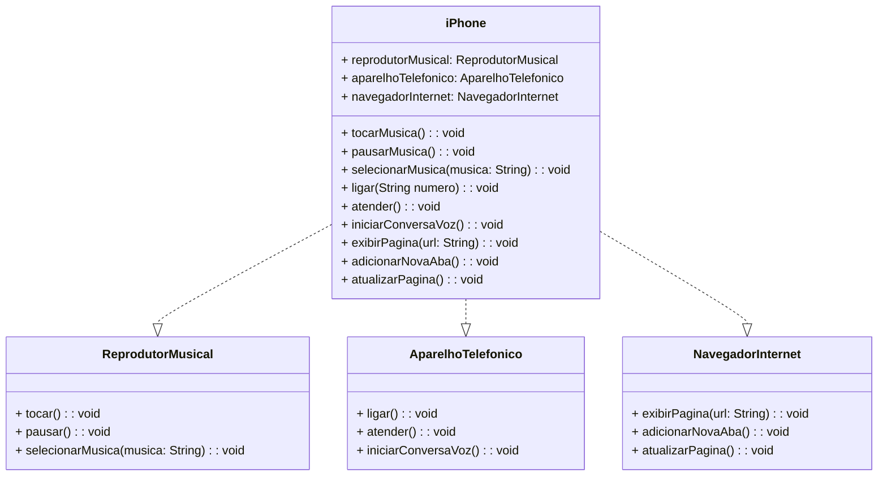

# Class diagram

```mermaid
classDiagram
    class iPhone {
        + reprodutorMusical: ReprodutorMusical
        + aparelhoTelefonico: AparelhoTelefonico
        + navegadorInternet: NavegadorInternet
        + tocarMusica(): void
        + pausarMusica(): void
        + selecionarMusica(musica: String): void
        + ligar(String numero): void
        + atender(): void
        + iniciarConversaVoz(): void
        + exibirPagina(url: String): void
        + adicionarNovaAba(): void
        + atualizarPagina(): void
    }
    class ReprodutorMusical {
    + tocar(): void
    + pausar(): void
    + selecionarMusica(musica: String): void
    }
    class AparelhoTelefonico {
    + ligar(): void
    + atender(): void
    + iniciarConversaVoz(): void
    }
    class NavegadorInternet {
    + exibirPagina(url: String): void
    + adicionarNovaAba(): void
    + atualizarPagina(): void
    }
    iPhone ..|> ReprodutorMusical
    iPhone ..|> AparelhoTelefonico
    iPhone ..|> NavegadorInternet
```